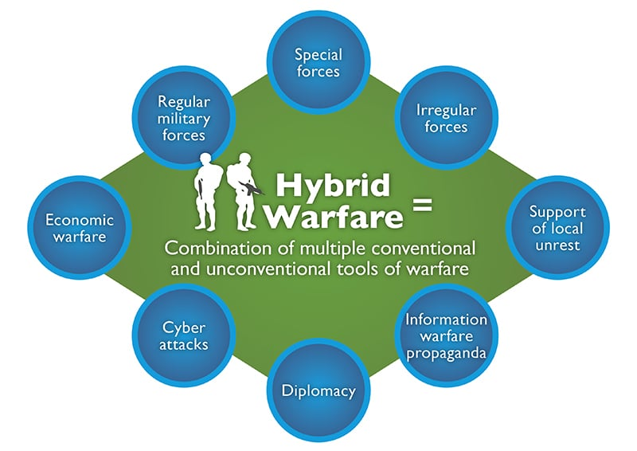

## Critical Infrastructure

There have been multiple breaches against the private and public sector from domestic to foreign groups. We've always been hearing about these things on the news and it's been costing our money, time, and even lives. I for one am a victim of a breach; as a young soldier, I was told that OPM was breached and millions of files on personnel were stolen, including mines. From then on, the growing threat of breaches and the enormous amount of vacant positions to fill for cybersecurity and information security grew. The Scholarship for Service was one proposed answer to this shortage of professionals. As a great way to earn an education and serve our nation and it's interests, this scholarship was an honor and privilege to receive.

## My Experience so Far

This scholarship has been a great opportunity to really take a glimpse into the pubic sector, just as much as the Army Reserves. I've been able to go to Job Fairs and receive information on opportunities available for internships and jobs. With my focus on networks, cybersecurity, intelligence, and engineering; I've been exploring this new world of the Intelligence Community and other aspects of engineering, policy making, intelligence, and cybersecurity that supports our government's responsiblities. Agencies or departments or some type of bureau that I have never heard became familiar to me as I started to learn more about how each fit into a puzzle that supported our federal and state levels. The enormous machine that I was learning about amazed me as it had to serve so many.

# Job Fair 2019 in Washington D.C

  

Here, we were at a job fair during the government shutdown where agencies, research labs, departments, bereaus, and other specialized organizations were recruiting prospective interns and employees. We were introduced to so many unknown entities that not many people see or hear of.

## We are surrounded...

The United States of America today seems to be surrounded by enemies on all sides. Although we do not have any major conventional wars, just conflicts, we have seem to replace conventional wars with assymetrical or hybrid wars where many nations are taking part in. The trade wars going on as well as probing cyber attacks are just signs that there is never really peace in the world. Our adversaries are probing us and watching us for weaknesses as others do the same to others. America seens no different to these other predatory nation-states, but I've learned that there are always far more worse things a country can do. My time in the Army Reserves and the scholarship have really opened my eyes to a new future of hybrid war where space, land, air, sea, and even the cyber realm will be integrated into a new theatre of conflict. Will we survive? 

  

# It seems so Foreign...

It is important for Americans, and especially those in living in Hawaii, to understand the new nature of warfare. People complain about the China and US trade war because of stagnating economic growth, but there are always reasons for this. Nation-states right now are at their most tense since the Cold War. The Cold War has never ended, it has evolved and the West is finally realizing this. For me, I've learned so much of the geopolitical, military, economic, and social issues over my time in the Army Reserves, and this scholarship has only increased my awareness of such topics. It isn't paranoia, it's something that all historians and analyst see and understand. 
