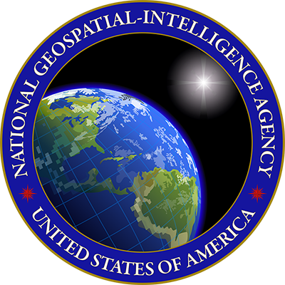
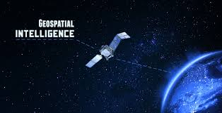

  
# What is GEOINT and IMINT?

### Geospatial Intelligence in the words of the National Geospatial Agency is:
> *GEOINT is the exploitation and analysis of imagery and geospatial information that describes, assesses and visually depicts physical features and geographically referenced activities on the Earth.*
 

  

  

  

  
### Imagery Intelligence in the words of the U.S Naval War College is:
> *Imagery Intelligence (IMINT) includes representations of objects reproduced electronically or by optical means on film, electronic display devices, or other media. Imagery can be derived from visual photography, radar sensors, infrared sensors, lasers, and electro-optics.*

 

  

## Intelligence Disciplines
In the intelligence community, these two disciplines are often linked together for good reason. Besides other intelligence disciplines that have been glamorized by Hollywood like the Human and Counter Intelligence disciplines used by the CIA and FBI like the Jason Bourne or Mission Impossible movies, GEOINT has not had much of a presence to the average American. However, it is a growing field of importance that influences satellite imagery, mapping, and geospatial data analytics. Google Maps, Digital Globe, and the GPS are just useful tools that many people today could not live without. It's presence in both national security and in industry are critical.
## Look at this! Can you find Waldo?

 

  

This is just one example of what we do with GEOINT. It provides a new perspective on situations that other disciplines cannot bring. The amount of information mixed with geospatial data can provide policymakers unfounded power in making decisions.
As an reservist, with whatever minimal time I have, I train by working trying to make products, taking classes on advanced imagery and geospatial methods, learning from full-time professionals, and learning the technical aspect of ARCGIS and Python that enables the creation of products as well as the sensors and platforms that enable imagery. 

## What I've gotten out of this

Besides learning about the great career opportunities in both the public and private sectors, I've learned so much about the ethics and work habits of what a professional should be. So many people depend on these professionals to deliver analytics and products that enable and shape policy, natural disaster emergencies, warfighting, environmental decisions, and so much more. The potential of this field is enormous and I've learned that there are more exciting fields to discover rather than ones laid out in college or the mainstream of people.
