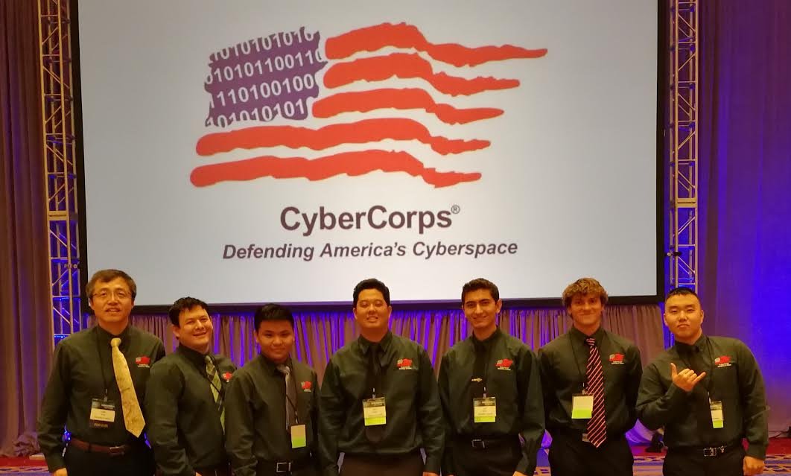

## ICS 414 and HACC 2020

  

The Hawaii Annual Code Challenge would bring approximately 200 developers every year. This amount of participants made forming teams a difficult task for participants and administrators. This obstacle became more apparent when the pandemic happened which resulted in no in-person meeting for HACC 2020. ICS 414 Software Engineering II was tasked by the hackathon hosts to build an application that allowed for easy registration and team formation for participants. This application used tool we used from ICS 314 including React, Meteor, MongoDB, and Semantic-UI. This was the first time ICS 414 would take on such a task and it was unprecendented. 

## Milestone 1

# Milestone 2

## Final Sprint

# Conclusion
 
