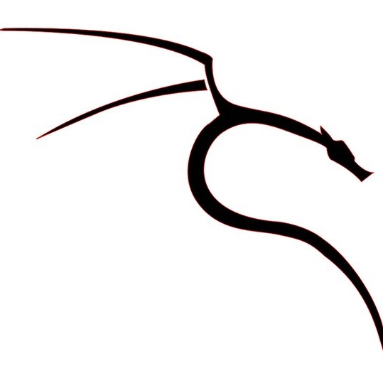
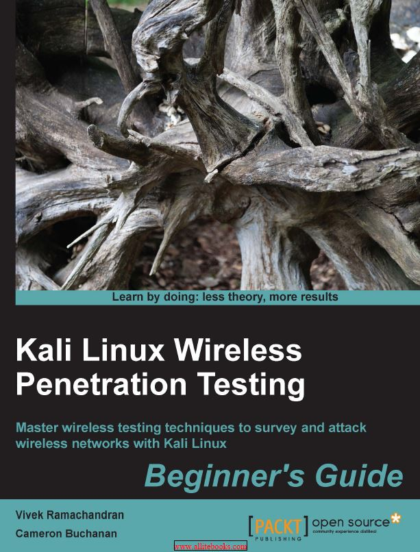
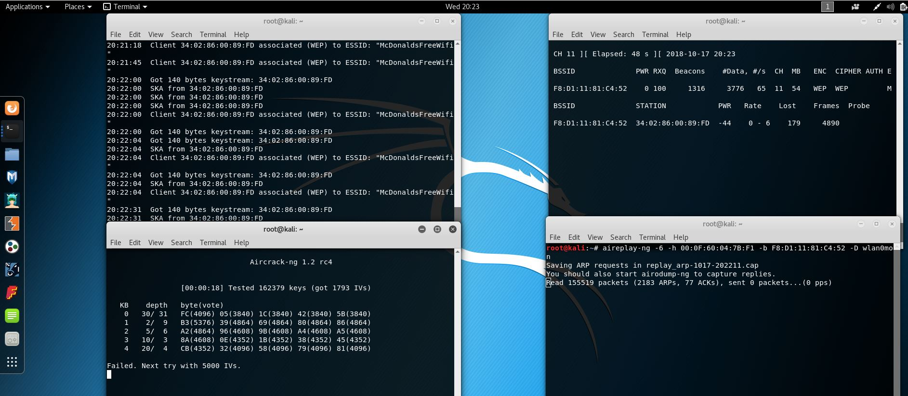
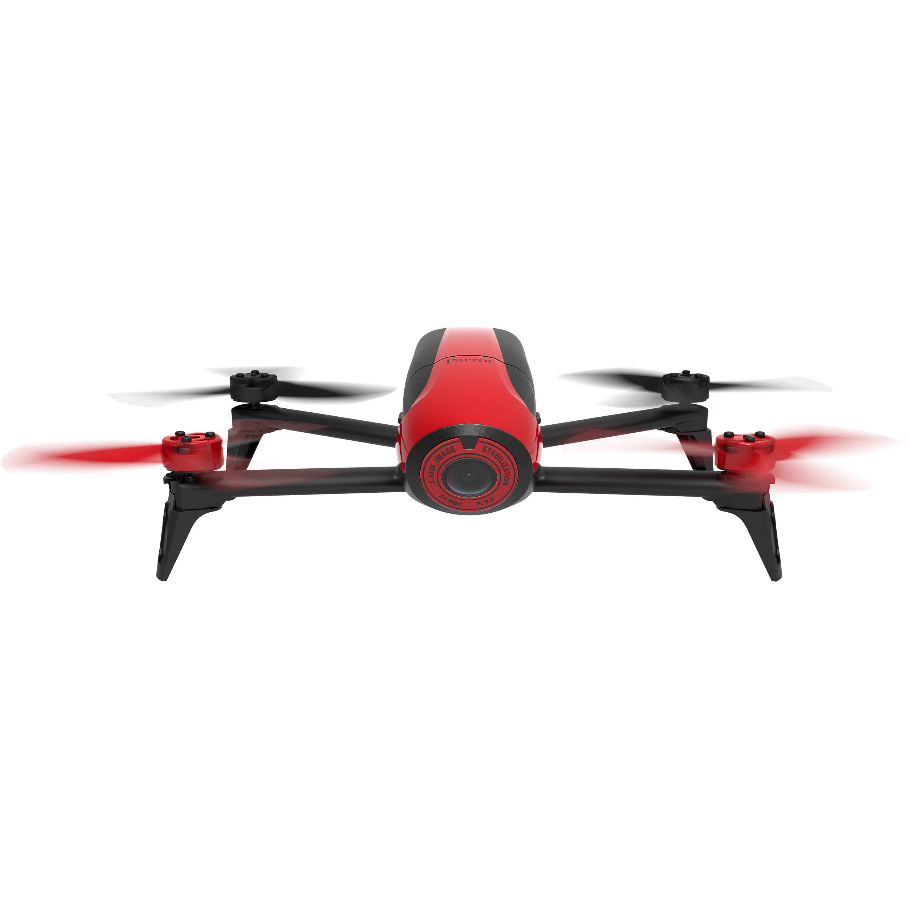

  

  

# Background to the College of Engineering Side of Projects
I've been on this project for two semesters and this semester will make it my third. For the engineering department, students must complete an engineering project or continue it for once for every year starting from their sophomore year to a capstone project in their senior year. For this project, we were tasked to learn the basics of the Kali Linux OS as well as the tools related to penetration testing, mainly Wireshark and aircrack-ng. We had to learn the basics of network protocol as well as how to sniff, spoof, and inject packets into communication protocols. We had to learn about the Wi-Fi security terms as well as the history and methods of Wi-Fi penetration attacks. We went over many of this with two instructional books: 
## 1) Kali Linux Wireless Penetration Testing (Beginner's Guide)
*Kali Linux Wireless Penetration Testing Beginner's Guide* is an open source packet containing information on the the equipment needed, methods used, and the basics of what is going on during network protocol. It is written by Vivek Ramachandran and Cameron Buchanan. Both authors are experienced professionals in their fields, Vivek is a leader in Wi-Fi security while Cameron is a penetration tester and writer.

  

 
This book is available online as a PDF for everyone to download and use. Some of the methods and equipment used is outdated today as this booklet came out in 2015. We had problems with certain methods as our equipment could not support the outdated security systems such as WPS or certain enterprise systems. We had a lot of trouble understanding the material as the pictures provided did not match the methods they asked us to do. Overall, we were able to accomplish the basics of cracking WEP and WPA keys. We have also gained proficiency and familiarity with using Wireshark and Kali Linux's terminal to use aircrack-ng, airodump-ng, and aireplay-ng. 

**Below are examples of the few attacks to crack a WEP key. We did more this semester, but there is too much information to share.**
## Hirte Attack

  

  
## Caffe Latte Attack
**This was a failure**

  
 
  
**This was a success**

  
 
  

## 2) Practical Packet Analysis 2nd Edition - Using Wireshark to Solve Real-World Network Problem
*Practical Packet Analysis 2nd Edition* is a crash course guide to network protocols and packet analysis. It goes over mostly Wireshark and its many features and methods in regards to capturing packets, analyzing packets, and the different type of protocols you would encounter. Our team did not go as in-depth with this book as the others and we are hoping to go more in-depth this semester.

 

  

# Future Direction
We plan on using what we learned from these two books to start capturing packets from a UAS using Wi-Fi communication with it's controller. From the packets we gather, we can provide analysis and software reverse engineering to try and decrypt the packets and eventually use the same keys to send packets of our own to disrupt or even take control of the UAS. Our goal is a Parrot Drone.

  

 

